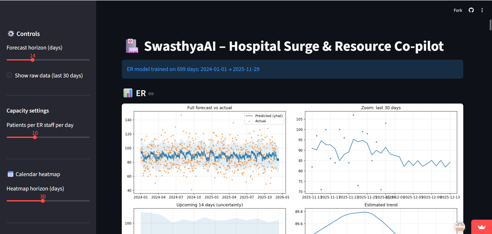
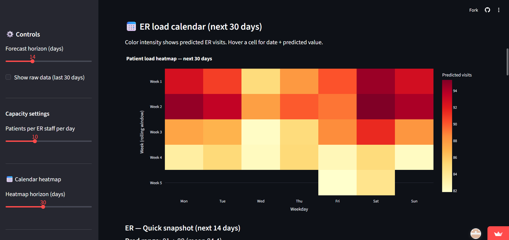
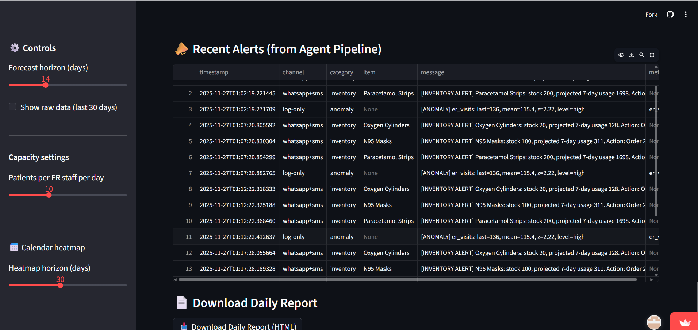

<div align="center">

# 🏥 SwasthyaAI
### Hospital Surge & Resource Co-Pilot

AI-Powered Predictive Healthcare Operations Dashboard


🚀 *Live Demo:*  
https://mumbaihacks2025-7urerztswuowvdmzggztdq.streamlit.app/

</div>

---

# 📖 Overview

SwasthyaAI is an AI-powered hospital operations dashboard designed to help hospitals predict patient surges, optimize staffing, monitor resources, and generate operational recommendations in real time.

Built for Mumbai Hacks 2025.

---

# 📸 Dashboard Preview

## 🏥 Main Dashboard



---

## 📈 Forecasting & Heatmap



---

## 📦 Inventory & Alerts



---

# ✨ Features

- 📈 ER & OPD Forecasting
- 🗓️ Calendar Heatmap
- 🧠 Executive Summary Engine
- 👨‍⚕️ Staffing Recommendations
- 📦 Inventory Intelligence
- 🚨 Alert Pipeline
- 📄 Daily Report Generation

---

# 🛠️ Tech Stack

- Python
- Streamlit
- Pandas
- NumPy
- Matplotlib
- Machine Learning

---

# 🚀 Run Locally

## Clone Repository

bash
git clone https://github.com/rahulsharma767/MumbaiHacks2025.git
cd SwasthyaAI
`

## Install Dependencies

bash
pip install -r requirements.txt


## Run App

bash
streamlit run app.py


---

# 🌟 USP

Unlike traditional hospital dashboards, SwasthyaAI does not just visualize data.

It:

* predicts trends
* analyzes capacity
* generates recommendations
* detects operational risks

in real time.

---

# 👨‍💻 Developed For

Mumbai Hacks 2025

Healthcare • AI • Predictive Operations

---

# ⭐ Support

If you like this project, give it a star on GitHub ⭐

```
```
